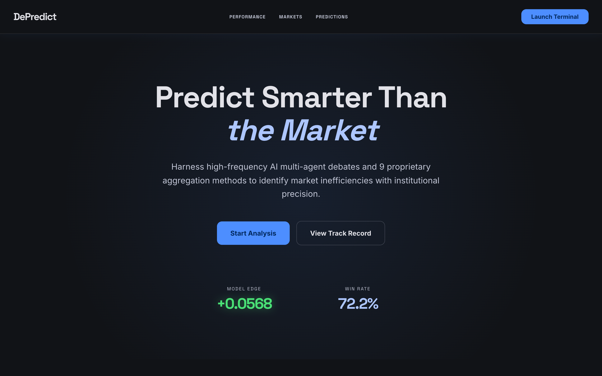
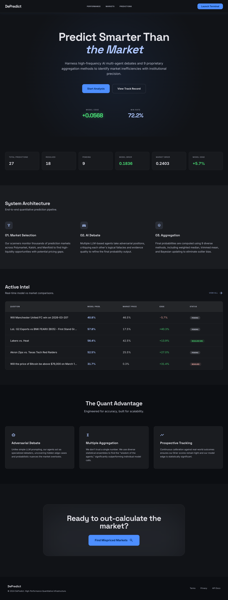
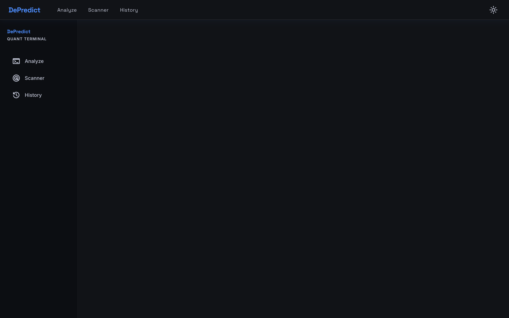
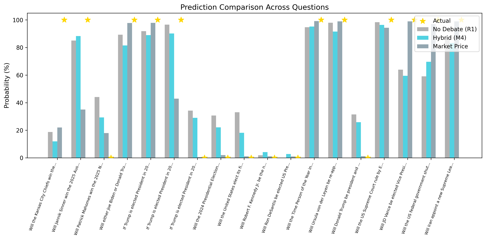
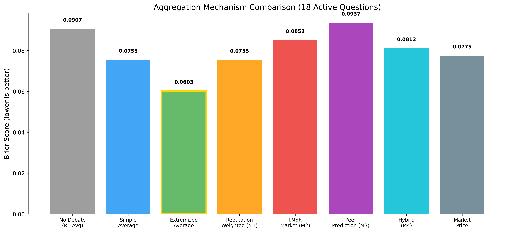
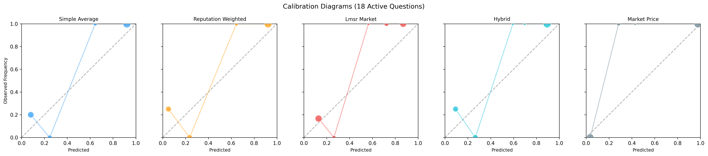
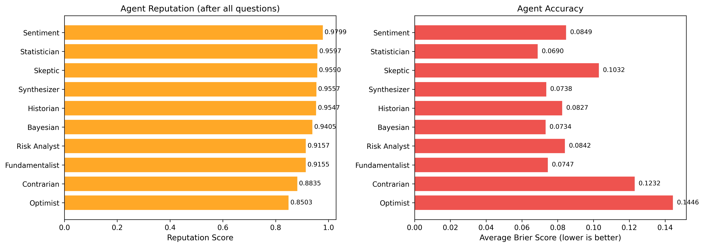
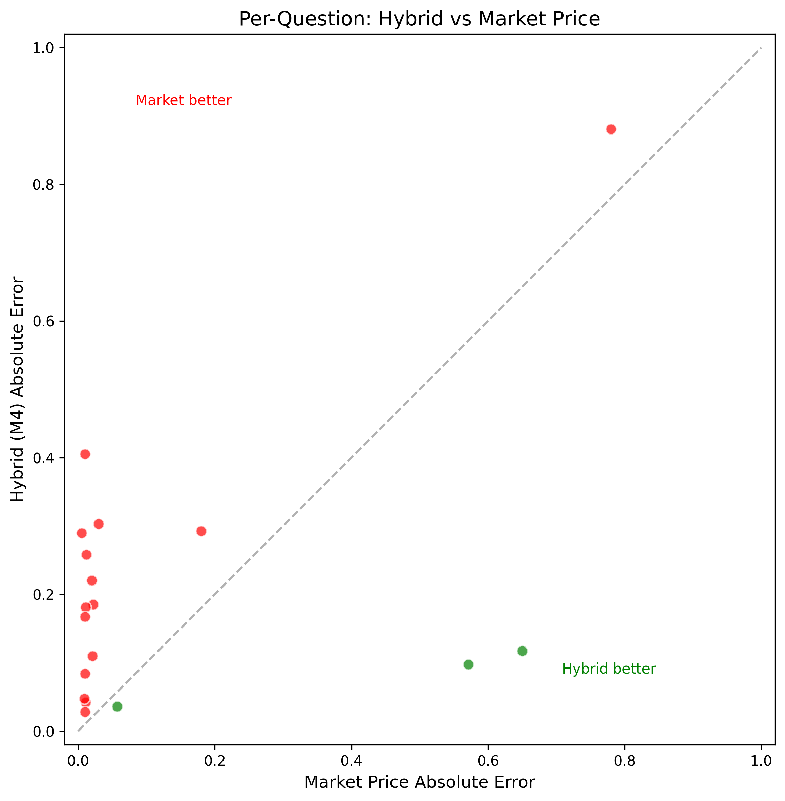
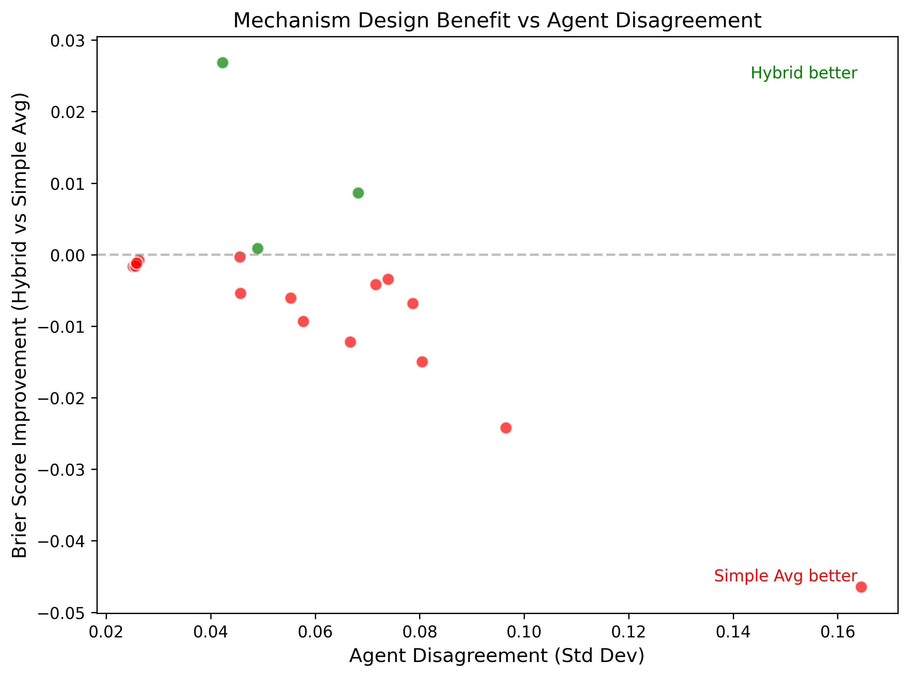

# DePredict

**Collective AI Deliberation: A Multi-Expert Consultation Framework for Human Opinion Refinement**

DePredict assembles multiple domain-specialized AI experts that engage in structured deliberation to help users refine their opinions and predictions. Rather than relying on a single LLM, it creates "structured cognitive conflict" among experts — surfacing blind spots, challenging biases, and producing calibrated probability forecasts.



## Live Demo

**[depredict.org](https://depredict.org)** — Try the Quant Terminal live.

## Screenshots

> **Homepage** — Landing page with live model performance metrics (Model Edge +0.0568, Win Rate 72.2%)



> **Quant Terminal** — Analyze, Scanner, and History views for market prediction



> **Prediction Comparison** — Aggregated predictions vs. market price



---

## Key Features

- **Multi-Expert Panels** — 5 AI experts with distinct analytical stances (supportive, questioning, cautious, neutral) powered by domain-specific knowledge profiles
- **Structured Debate Pipeline** — 3-round debate: independent analysis → cross-rebuttal → final prediction
- **Interactive Consultation** — Users can engage in free-form dialogue with individual experts before synthesis
- **9 Aggregation Methods** — From simple average to LMSR prediction markets, Bayesian Truth Serum, reputation-weighted, and hybrid mechanisms
- **RAG with RAFT** — YouTube transcripts + Tavily news retrieval with oracle/distractor document mixing
- **Information Partitioning** — 40% shared + 60% private documents per expert, ensuring genuinely independent perspectives

## Architecture

```
┌─────────────────────────────────────────────────────┐
│                    Frontend (Vue)                     │
│              Vite + Nginx (port 3000)                │
├─────────────────────────────────────────────────────┤
│                   Caddy (HTTPS)                      │
├─────────────────────────────────────────────────────┤
│                 Backend (Flask)                       │
│                                                      │
│  ┌──────────┐  ┌──────────┐  ┌───────────────────┐  │
│  │  Debate   │  │ Consult  │  │    Retriever      │  │
│  │ Pipeline  │  │  Agent   │  │ (YouTube+Tavily)  │  │
│  └────┬─────┘  └────┬─────┘  └───────────────────┘  │
│       │              │                                │
│  ┌────▼──────────────▼─────┐  ┌───────────────────┐  │
│  │   AI Expert Agents (5)  │  │   Aggregator      │  │
│  │   DeepSeek / OpenAI     │  │   (9 methods)     │  │
│  └─────────────────────────┘  └───────────────────┘  │
└─────────────────────────────────────────────────────┘
```

## Two Modes

| Mode | Interface | Use Case |
|------|-----------|----------|
| **Debate** (`app.py`) | Streamlit dashboard | Automated 3-round debate among 10 AI analysts with probability aggregation |
| **Consultation** (`app_consult.py`) | Streamlit multi-phase | Interactive 4-phase expert consultation with user dialogue |

### Debate Mode
1. Submit a prediction question with optional market reference price
2. 10 AI analysts independently analyze, then cross-rebut over 3 rounds
3. View prediction shifts, RAFT metrics, and aggregated probabilities vs. market price

### Consultation Mode
1. Select domain, submit topic with your reasoning
2. **Phase 1**: Experts independently evaluate your opinion
3. **Phase 2**: Chat with individual experts in tabbed interface
4. **Phase 3**: Experts cross-examine each other's assessments
5. **Phase 4**: Final synthesis with confidence metrics, blind spots, and risk warnings

## Aggregation Methods

| Method | Description |
|--------|-------------|
| Simple Average | Arithmetic mean |
| Median | Robust to outliers |
| Trimmed Mean | Removes extremes before averaging |
| Logit Average | Aggregation in log-odds space |
| Extremized Average | Pushes consensus away from 50% |
| Reputation-Weighted | Weights by historical Brier Score performance |
| LMSR Market | Hanson's Logarithmic Market Scoring Rule with Kelly-criterion sizing |
| Peer Prediction (BTS) | Bayesian Truth Serum — scores via meta-predictions |
| Hybrid | Weighted combination: λ₁·P_market + λ₂·P_reputation + λ₃·P_bts |

## Domain Support

- **Cryptocurrency** — On-chain analysis, macroeconomics, crypto-native research, risk management, regulatory policy
- **Sports** — Statistical analysis, tactical matchups, injury/performance medicine, betting markets, narrative/intangibles

## Project Structure

```
.
├── app.py                 # Debate mode (Streamlit)
├── app_consult.py         # Consultation mode (Streamlit)
├── agent.py               # Debate agent implementation
├── consult_agent.py       # Consultation agent implementation
├── debate.py              # 3-round debate pipeline
├── aggregator.py          # 9 aggregation mechanisms
├── retriever.py           # RAG: YouTube + Tavily retrieval with RAFT
├── scraper.py             # Data collection utilities
├── analysis.py            # Result analysis tools
├── experiment.py          # Experiment runner
├── significance.py        # Statistical significance tests
├── frontend/              # Vue.js frontend (Vite + Nginx)
│   └── src/
│       ├── api/           # API integration
│       ├── components/    # Reusable UI components
│       ├── views/         # Page views
│       ├── router/        # Route configuration
│       └── store/         # State management
├── expert_knowledge/      # Domain-specific knowledge profiles
├── prompts/               # LLM prompt templates
├── data/
│   ├── questions.json     # Prediction questions
│   ├── prospective/       # Prospective evaluation data
│   └── results/           # Debate/consultation results
├── scripts/               # Batch experiments & utilities
├── paper/                 # Research whitepaper (EN/CN) + LaTeX
├── figures/               # Result visualizations & charts
├── docker-compose.yml     # Container orchestration
├── Caddyfile              # HTTPS reverse proxy config
└── DEPLOY.md              # Deployment guide
```

## Quick Start

### Prerequisites

- Python 3.11+
- [DeepSeek API key](https://platform.deepseek.com/) (or any OpenAI-compatible LLM)
- [Tavily API key](https://tavily.com/) (for news retrieval)

### Local Development

```bash
git clone https://github.com/Andrewyzzz/Depredict.git
cd Depredict
cp .env.example .env
# Edit .env with your API keys:
#   DEEPSEEK_API_KEY=your_key
#   TAVILY_API_KEY=your_key

pip install -r requirements.txt

# Debate mode
streamlit run app.py

# Consultation mode
streamlit run app_consult.py
```

### Production Deployment (Docker)

```bash
ssh root@your-vps
apt update && curl -fsSL https://get.docker.com | sh
cd /opt && git clone https://github.com/Andrewyzzz/Depredict.git
cd Depredict
cp .env.example .env
# Edit .env with API keys and domain
# Edit Caddyfile with your domain (or :80 for IP-only access)
docker compose up -d --build
```

See [DEPLOY.md](DEPLOY.md) for detailed deployment instructions.

## Research

The project includes a research whitepaper exploring the theoretical foundations and evaluation framework:

- [Whitepaper (English)](paper/whitepaper.pdf)
- [白皮书 (中文)](paper/whitepaper_cn.pdf)

### Evaluation Metrics
- **Brier Score** comparison across aggregation methods
- **Calibration** curves for prediction accuracy
- **Agent reputation** convergence over time
- **Hybrid vs. market** mechanism performance

<details>
<summary>Research Figures</summary>

| Figure | Description |
|--------|-------------|
|  | Brier Score comparison across aggregation methods |
|  | Prediction calibration curves |
|  | Agent reputation scores over time |
|  | Hybrid mechanism vs. pure market |
|  | Disagreement-driven improvement |

</details>

## Tech Stack

| Component | Technology |
|-----------|------------|
| LLM Backend | DeepSeek V3 (primary), OpenAI/Anthropic/Google compatible |
| Backend | Python, Flask |
| Frontend | Vue.js, Vite |
| Visualization | Plotly, Streamlit |
| Retrieval | YouTube Transcripts, Tavily API |
| Deployment | Docker Compose, Caddy, Nginx |

## License

See repository for license information.
